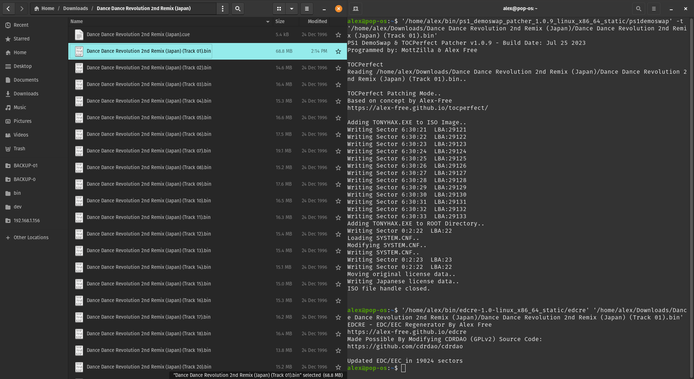
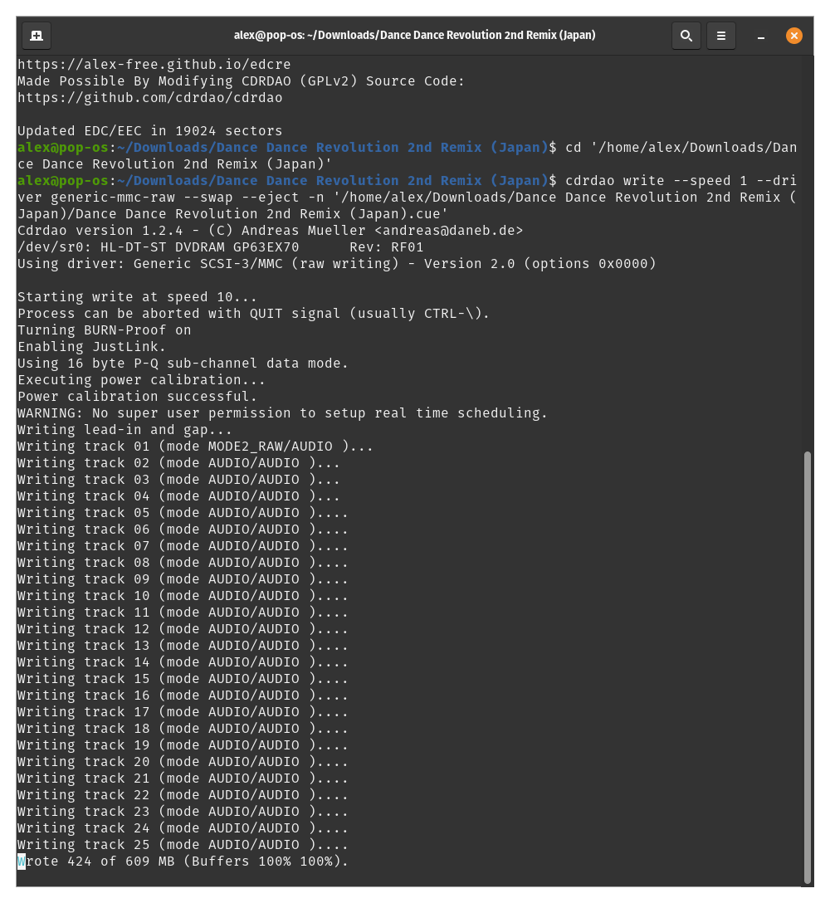

# [alex-free.github.io](https://alex-free.github.io)

# EDCRE: EDC/EEC Regenerator For BIN+CUE CD Disc Images

EDCRE provides a solution to update EDC/EEC data to match any patching done to a data track of a CD image. This allows PSX games with [EDC Protection](https://alex-free.github.io/aprip#edc) to be patched and hacked successfully with programs such as [PS1 DemoSwap Patcher](https://alex-free.github.io/ps1demoswap#tocperfect-patch) and [APrip](https://alex-free.github.io/aprip/#patching-the-cd-image) using a clever [workaround](#psx-edc-protection-workaround-with-edcre) turned on by default. EDCRE is not limited to EDC Protected PSX games however, just specify the `-z` argument to enforce all sectors to be checked and fixed with updated EDC/EEC data if needed.

## Table of Contents

* [Downloads](#downloads)
* [EDC/EEC Data](#edceec-data)
* [PSX EDC Anti-Piracy Protection](#psx-edc-anti-piracy-protection)
* [PSX EDC Protection Workaround With EDCRE](#psx-edc-protection-workaround-with-edcre)
* [Usage](#usage)
* [License](#license)
* [Credits](#credits)

## Links

*	[Homepage](https://alex-free.github.io/edcre)
*	[Github](https://github.com/alex-free/edcre)
*   [CDRDAO-PLED](https://alex-free.github.io/cdrdao)
*   [APrip](https://alex-free.github.io/aprip)
*   [PS1 DemoSwap Patcher](https://alex-free.github.io/ps1demoswap)
*	[Tonyhax International](https://alex-free.github.io/tonyhax-international)
*	[Tonyhax International APv2 Bypass System](https://alex-free.github.io/tonyhax-international/anti-piracy-bypass.html)

## Downloads

### Version 1.0.2 (8/21/2023)

*	[edcre-1.0.2-windows\_x86](https://github.com/alex-free/edcre/releases/download/v1.0.2/edcre-1.0.2-windows_x86.zip) _For Windows 95 OSR 2.5 Or Newer (32-bit Windows)_
*	[edcre-1.0.2-windows\_x86\_64](https://github.com/alex-free/edcre/releases/download/v1.0.2/edcre-1.0.2-windows_x86_64.zip) _For 64-bit Windows_
*	[edcre-1.0.2-linux\_x86](https://github.com/alex-free/edcre/releases/download/v1.0.2/edcre-1.0.2-linux_x86_static.zip) _For x86 Linux Distros_
*	[edcre-1.0.2-linux\_x86\_64](https://github.com/alex-free/edcre/releases/download/v1.0.2/edcre-1.0.2-linux_x86_64_static.zip) _For x86_64 Linux Distros_
*	[edcre-1.0.2-source](https://github.com/alex-free/edcre/archive/refs/tags/v1.0.2.zip)

Changes:

*   Changed default behavior to start regen at sector 15 (to enable using this to update EDC after TOCPerfect patching).

[About previous versions](changelog.md).

## What Is EDC/EEC Data?

EDC is a special checksum that verifies the integrity of the user data portion of a sector in a data track. If during a sector read the EDC does not match the data read by the CD drive, EEC data then provides a way to correct the data to what was expected in most cases. If a significant amount of the sector is unreadable or modified this may not be correctable with EEC data, but in many common cases (i.e. slightly scratched discs) it does work quite well and provides much more reliability and resilience for data CD reading. 

When you edit a data track in a CD image, the original EDC and EEC will remain untouched causing it to mismatch the new contents of the user data in any modified sectors, causing any changes to not take effect or invalidate the disc image when it is burned to a disc and used on real hardware. Usually this isn't a problem however since almost all CD burning software writes updated EDC/EEC to burned discs, and most emulators ignore the EDC/EEC data in sectors by design. [IMGBurn](https://www.imgburn.com/) always writes updated EDC/EEC data, and there isn't a way to disable that behavior. [CDRDAO](https://github.com/cdrdao/cdrdao) always writes updated EDC/EEC data when using the default `generic-mmc` driver. It is possible however specify the `generic-mmc-raw` be used instead which **does not modify EDC/EEC data and leaves it as is**. [CloneCD](https://www.redfox.bz/en/clonecd.html) always writes updated EDC/EEC data **unless you use the RAW writing mode**. Writing updated EDC data to disc is usually what you want, that way the correct matching EDC/EEC data correlates to any modification to the user data of sectors found in a disc image. 

But what if you want to edit user data of sectors in a data track of a CD disc image and then write it raw? That is exactly what I want to do, as it defeats the EDC-based anti-piracy protection measure found in almost all of the [Dance Dance Revolution PSX games](https://alex-free.github.io/aprip#edc).

## PSX EDC Anti-Piracy Protection

The idea of EDC/EEC based additional anti-piracy protection is a brilliantly flawed one. See, Sony's tools to generate disc images back in the day were [buggy](http://www.psxdev.net/forum/viewtopic.php?t=1475). One such bug appears to be that the [reserved sectors 12-15](http://problemkaputt.de/psx-spx.htm#cdromisovolumedescriptors), which are zero filled in the user data portion of the sector, _also_ **have an EDC checksum of zero**. The correct checksum for a zero-filled user data sector _should be_ `3F 13 B0 BE`, _but it isn't_. It's `00 00 00 00` like the rest of the sector besides the sync data. This actually doesn't matter in practice, so the bug went unoticed and the technically invalid sector 12-15s shipped on real licensed PSX CD-ROMs. This apparently got fixed eventually in some newer version of the `cdgen` Sony tool that created disc images.

Someone working on the Dance Dance Revolution PSX games noticed this strange behavior and figured out that it could be exploited as an additional anti-piracy protection measure. If the real licensed PSX CD-ROM discs were shipped with an EDC checksum of zero in sector 12-15, then when someone went to rip the real licensed PSX CD-ROM disc and then burn it back to a CD-R, the EDC checksum in sector 12-15 would no longer be `00 00 00 00`, it would be the expected `3F 13 B0 BE`. [Game code](https://github.com/socram8888/tonyhax/issues/121#issuecomment-1341381549) can read the EDC checksum on the disc at sector 12, and a routine could then lock up the game if the EDC data is non-zero to deter piracy.

## PSX EDC Protection Workaround With EDCRE

EDCRE has a simple solution to allow edited/patched PSX disc images that have EDC Protection to work on real PSX hardware. By default (unless you specify the `-z` argument to specify updating all sectors in a disc image, starting at sector 0) It regenerates all EDC/EEC data starting at the 15th sector (LBA 15 in disc image/165 on disc) instead of starting at the first sector (LBA 0 in disc image/150 on disc). Because the 'reserved' zero-filled sectors 12-14 are untouched by EDCRE (sector 15 is also reserved but since it is utilized in TOCPerfect patching and doesn't effect EDC protection we still regen it), the EDC protection never triggers in-game if you burn the disc image RAW using [CloneCD](https://www.redfox.bz/en/clonecd.html) or [CDRDAO](https://github.com/cdrdao/cdrdao). At the same time any edits/patches made to a PSX disc image will have matching EDC/EEC data (since any such edits would be on the game data itself which starts at the 16th sector) allowing patches to the data track work correctly on real hardware.

## Usage

EDCRE is a command line program. On Windows and most Linux distributions, you can simply drag and drop the "track 01.bin" file of the PSX game you want to update EDC/EEC data for.

If you want to see more verbose info, and or if you want to update EDC/EEC data for all sectors (what you probably want if the data track bin file is not an EDC Protected PSX game but rather something else), you need to execute `edcre` with command line options:

`edcre <original data track>`

`edcre -v <original data track>    (display verbose info)`

`edcre -z <original data track>    (disc image is not an EDC protected PSX game, update EDC/EEC data starting at sector 0)`

`edcre -z -v <original data track>    (disc image is not a PSX EDC game, update EDC/EEC data starting at sector 0 and display verbose info)`

### Windows

*   Start cmd.exe and provide the executable file.
*   Provide any additional arguments (optional) (`-z` and or `-v`).
*   Provide the disc image data track bin file as the last argument and execute the command, such as:
    `edcre.exe -v "track 01.bin"`

### Linux CLI

*   Start Terminal and provide the executable file.
*   Provide any additional arguments (optional) (`-z` and or `-v`).
*   Provide the disc image data track bin file as the last argument and execute the command, such as:
    `./edcre" -v "track 01.bin"`

### Burning EDCRE Patched Disc Images

I recommend using the latest CDRDAO v1.2.5 which unlike previous versions supports burning EDC Protected PSX games with CD audio tracks correctly using the `generic-mmc-raw` driver. There are pre-built portable releases of a new enough CDRDAO for Linux [available](https://alex-free.github.io/cdrdao). The required command syntax for burning EDCRE patched games is this:

`cdrdao write --speed 1 --driver generic-mmc-raw --swap -n --eject yourgame.cue`

Lets breakdown what each of these arguments to CDRDAO do:

*   `--speed 1` argument sets the writing speed to the slowest your CD burner supports.

*   `--driver generic-mmc-raw` specifies CDRDAO to use the `generic-mmc-raw` driver, which burns the CD image exactly as it is. The default driver used without specifiying these arguments is the **`generic-mmc` driver, which like the other drivers in CDRDAO will auto-regenerate EDC data as the CD image is burned.** This can change the EDC data read from the burned disc later, which some PSX games use as an additional anti-piracy check which if failed will lock up [the game](https://alex-free.github.io/tonyhax-international/anti-piracy-bypass.html#games-with-edc-protection).

*   `--swap` is necessary if the BIN/CUE CD image contains CD audio. Without it, you will get loud static when the CD audio tracks are played as they are by default byte-swapped by CDRDAO if this argument is not specified.

*   `-n` disables the 10 second waiting period before burning.

*   `--eject` will automatically eject the disc immediately after a successful burn.

### Example Burn

The example below is using the [PS1 DemoSwap Patcher's](https://alex-free.github.io/ps1demoswap) [TOCPerfect Patch Mode](https://alex-free.github.io/ps1demoswap/#tocperfect-patch-2) to first hack the Dance Dance Revolution 2nd Remix Japan game to boot the Tonyhax Loader first before the main game executable, which enables perfect loading via the [CD Player Swap Trick](https://alex-free.github.io/ps1demoswap#cd-player-swap-trick) found on early PSX consoles. Then EDCRE is ran, and it is burned RAW via CDRDAO.

## License

EDCRE is modified [CDRDAO](https://github.com/cdrdao/cdrdao) source code, which is licensed under the GPLv2 license. Please see the file `license.txt` in each release for full info.

## Credits

*   [CDRDAO](https://github.com/cdrdao/cdrdao) source code.
*   [Socram8888](https://github.com/socram8888) for providing info on [how the game code detects the EDC checksum](https://github.com/socram8888/tonyhax/issues/121#issuecomment-1341365357).
*   [MottZilla](https://github.com/mottzilla) for coming up with the workaround idea: "Just don't update those sectors" lol.