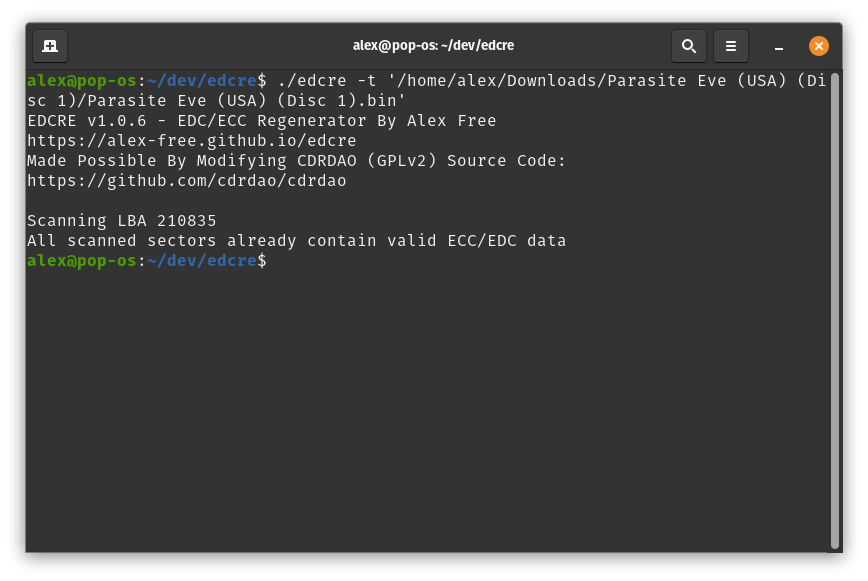

# EDCRE: EDC/ECC Regenerator For BIN+CUE CD Disc Images

EDCRE provides an advanced solution to detect and or update EDC/ECC data to match any edits done to a data track of a CD image.

## Table of Contents

* [Downloads](#downloads)
* [What Is EDC/ECC Data?](#what-is-edcecc-data)
* [PSX EDC Anti-Piracy Protection](#psx-edc-anti-piracy-protection)
* [PSX EDC Protection Workaround With EDCRE](#psx-edc-protection-workaround-with-edcre)
* [Usage](#usage)
* [Building](build.md)
* [License](#license)
* [Credits](#credits)

## Links

*	[Homepage](https://alex-free.github.io/edcre)
*	[Github](https://github.com/alex-free/edcre)
*   [CDRDAO-PLED](https://alex-free.github.io/cdrdao)
*   [APrip](https://alex-free.github.io/aprip)
*   [TOCPerfect Patcher](https://alex-free.github.io/tocperfect)
*   [PS1 DemoSwap Patcher](https://alex-free.github.io/ps1demoswap)
*	[Tonyhax International](https://alex-free.github.io/tonyhax-international)
*	[Tonyhax International APv2 Bypass System](https://alex-free.github.io/tonyhax-international/anti-piracy-bypass.html)
*   [The Ultimate Guide To PSX CD-Rs](https://alex-free.github.io/psx-cdr)

## Downloads

### Version 1.0.7 (7/4/2024)

Changes:

*  Added the ability to use existing sector header data MM:SS:FF while also updating EDC/ECC data (`-k` argument). This is useful for an example like [this use-case](https://github.com/alex-free/edcre/issues/1), where you want to update the EDC/ECC on an 'end part' of an incomplete disc image, without regenerating the MM:SS:FF info in the sector header data from 0.

*   Implemented my [EzRe](https://github.com/alex-free/ezre) build system.

----------------------------------------------------

*	[edcre-v1.0.7-windows-i686-static.zip](https://github.com/alex-free/edcre/releases/download/v1.0.7/edcre-v1.0.7-windows-i686-static.zip) _Portable Release For Windows 95 OSR 2.5 and above, Pentium CPU minimum (32 bit)_

*	[edcre-v1.0.7-windows-x86\_64-static.zip](https://github.com/alex-free/edcre/releases/download/v1.0.7/edcre-v1.0.7-windows-x86_64-static.zip) _Portable Release For x86_64 Windows (64 bit)_

*	[edcre-v1.0.7-linux-i386-static.zip](https://github.com/alex-free/edcre/releases/download/v1.0.7/edcre-v1.0.7-linux-i386-static.zip) _Portable Release For Linux 3.2.0 and above, 386 CPU minimum (32 bit)_

*	[edcre-v1.0.7-linux-i386-static.deb](https://github.com/alex-free/edcre/releases/download/v1.0.7/edcre-v1.0.7-linux-i386-static.deb) _Deb package file For Linux 3.2.0 and above, 386 CPU minimum (32 bit)_

*	[edcre-v1.0.7-linux-x86\_64-static.zip](https://github.com/alex-free/edcre/releases/download/v1.0.7/edcre-v1.0.7-linux-x86_64-static.zip) _Portable Release For x86\_64 Linux 3.2.0 and above (64 bit)_

*	[edcre-v1.0.7-linux-x86\_64-static.deb](https://github.com/alex-free/edcre/releases/download/v1.0.7/edcre-v1.0.7-linux-x86_64-static.deb) _Deb package file for x86_64 Linux 3.2.0 and above (64 bit)_

----------------------------------------------------

[About previous versions](changelog.md).

## What Is EDC/ECC Data?

EDC is a special checksum that verifies the integrity of the user data portion of a sector in a data track. If during a sector read the EDC does not match the data read by the CD drive, ECC data then provides a way to correct the data to what was expected in most cases. If a significant amount of the sector is unreadable or modified this may not be correctable with ECC data, but in many common cases (i.e. slightly scratched discs) it does work quite well and provides much more reliability and resilience for data CD reading. 

When you edit a data track in a CD image, the original EDC and ECC will remain untouched causing it to mismatch the new contents of the user data in any modified sectors, causing any changes to not take effect or invalidate the disc image when it is burned to a disc and used on real hardware. Usually this isn't a problem however since almost all CD burning software writes updated EDC/ECC to burned discs, and most emulators ignore the EDC/ECC data in sectors by design. [IMGBurn](https://www.imgburn.com/) always writes updated EDC/ECC data, and there isn't a way to disable that behavior. [CDRDAO](https://github.com/cdrdao/cdrdao) always writes updated EDC/ECC data when using the default `generic-mmc` driver. It is possible however specify the `generic-mmc-raw` be used instead which **does not modify EDC/ECC data and leaves it as is**. [CloneCD](https://www.redfox.bz/en/clonecd.html) always writes updated EDC/ECC data **unless you use the RAW writing mode**. Writing updated EDC data to disc is usually what you want, that way the correct matching EDC/ECC data correlates to any modification to the user data of sectors found in a disc image. 

But what if you want to edit user data of sectors in a data track of a CD disc image and then write it raw? That is exactly what I want to do, as it defeats the EDC-based anti-piracy protection measure found in almost all of the [Dance Dance Revolution PSX games](https://alex-free.github.io/aprip#edc).

## PSX EDC Anti-Piracy Protection

The idea of EDC/ECC based additional anti-piracy protection is a brilliantly flawed one. See, Sony's tools to generate disc images back in the day were [buggy](http://www.psxdev.net/forum/viewtopic.php?t=1475). One such bug appears to be that the [reserved sectors 12-15](http://problemkaputt.de/psx-spx.htm#cdromisovolumedescriptors), which are zero filled in the user data portion of the sector, _also_ **have an EDC checksum of zero**. The correct checksum for a zero-filled user data sector _should be_ `3F 13 B0 BE`, _but it isn't_. It's `00 00 00 00` like the rest of the sector besides the sync data. This actually doesn't matter in practice, so the bug went unoticed and the technically invalid sector 12-15s shipped on real licensed PSX CD-ROMs. This apparently got fixed eventually in some newer version of the `cdgen` Sony tool that created disc images.

Someone working on the Dance Dance Revolution PSX games noticed this strange behavior and figured out that it could be exploited as an additional anti-piracy protection measure. If the real licensed PSX CD-ROM discs were shipped with an EDC checksum of zero in sector 12-15, then when someone went to rip the real licensed PSX CD-ROM disc and then burn it back to a CD-R, the EDC checksum in sector 12-15 would no longer be `00 00 00 00`, it would be the expected `3F 13 B0 BE`. [Game code](https://github.com/socram8888/tonyhax/issues/121#issuecomment-1341381549) can read the EDC checksum on the disc at sector 12, and a routine could then lock up the game if the EDC data is non-zero to deter piracy.

## PSX EDC Protection Workaround With EDCRE

EDCRE has a simple solution to allow edited/patched PSX disc images that have EDC Protection to work on real PSX hardware. By using the `-s 16` argument, you can not touch the checked sector (12) and instead only regenerate EDC/ECC data for all data sectors starting at the system volume descriptor sector (16/LBA 166).

if you burn the disc image RAW using [CloneCD](https://www.redfox.bz/en/clonecd.html) or [CDRDAO](https://github.com/cdrdao/cdrdao). At the same time any edits/patches made to a PSX disc image will have matching EDC/ECC data (since any such edits would be on the game data itself which starts at the 16th sector) allowing patches to the data track work correctly on real hardware.

## Usage

EDCRE is a command line program. On Windows and most Linux distributions, you can simply drag and drop the "track 01.bin" file of the PSX game you want to update EDC/ECC data for.

If you want to see more verbose info, and or if you want to update EDC/ECC data for all sectors (what you probably want if the data track bin file is not an EDC Protected PSX game but rather something else), you need to execute `edcre` with command line options:

`Usage: edcre <optional arguments> <track 01 bin file>`

`Optional Arguments:`

`-v    Verbose, display each sector LBA number containing invalid EDC data, if any.`

`-t   Test the disc image for sectors that contain invalid EDC/ECC. Does not modify the track bin file in any way.`

`-s    Start EDC/ECC regeneration at sector number following the -s argument instead of at sector 0. In example, -s 16 starts regeneration at sector 16 (LBA 166) which would be the system volume for a PSX disc image (and what is recommended most of the time). TOCPerfect Patcher users want -s 15 here however.`

`-k   Keep existing sector header data from data file. This prevents EDCRE from regenerating the MM:SS:FF in the sector header. Useful for testing or regenerating EDC/ECC in a disc image file snippet (i.e. the last data track pregap of a Dreamcast GD-ROM image doesn't start at sector 0 and is a separate file).`

-----------------------------------------------------

### Windows

*   Start cmd.exe and provide the executable file.

*   Provide any additional arguments (`-v`, `-t` `-s <sector number>`).

*   Provide the disc image data track bin file as the last argument (which must be argument 1, 2, or 3 depending on how many additional arguments, if any, that you are using) and execute the command, such as:
    `edcre.exe -v "track 01.bin"`

### Linux

*   Start Terminal and provide the executable file.

*   Provide any additional arguments (up to 2 additional arguments can be specified at once) (optional) (`-v`, `-t`, `-s <sector number>`).

*   Provide the disc image data track bin file as the last argument (which must be argument 1, 2, or 3 depending on how many additional arguments, if any, that you are using) and execute the command, such as:
    `./edcre -v "track 01.bin"`

### Burning EDCRE Patched Disc Images

### CDRDAO v1.2.5

The latest CDRDAO v1.2.5 also supports burning EDC Protected PSX games with CD audio tracks correctly using the `generic-mmc-raw` driver. There are pre-built portable releases of a new enough CDRDAO for Linux [available](https://alex-free.github.io/cdrdao). The required command syntax for burning EDCRE patched games is this:

`cdrdao write --speed x --driver generic-mmc-raw --swap -n --eject yourgame.cue`

Breakdown what each of these arguments to CDRDAO do:

*   `--speed x` argument sets the writing speed. Replace `x` with a number.

*   `--driver generic-mmc-raw` specifies CDRDAO to use the `generic-mmc-raw` driver, which burns the CD image exactly as it is. The default driver used without specifiying these arguments is the **`generic-mmc` driver, which like the other drivers in CDRDAO will auto-regenerate EDC data as the CD image is burned.** This can change the EDC data read from the burned disc later, which some PSX games use as an additional anti-piracy check which if failed will lock up [the game](https://alex-free.github.io/tonyhax-international/anti-piracy-bypass.html#games-with-edc-protection).

*   `--swap` is necessary if the BIN/CUE CD image contains CD audio. Without it, you will get loud static when the CD audio tracks are played as they are by default byte-swapped by CDRDAO if this argument is not specified.

*   `-n` disables the 10 second waiting period before burning.

*   `--eject` will automatically eject the disc immediately after a successful burn.

## License

EDCRE is modified [CDRDAO](https://github.com/cdrdao/cdrdao) source code, which is licensed under the GPLv2 license. Please see the file `license.txt` in each release for full info.

## Credits

*   [CDRDAO](https://github.com/cdrdao/cdrdao) source code.
*   [Socram8888](https://github.com/socram8888) for providing info on [how EDC Protected games detect a corrected EDC checksum](https://github.com/socram8888/tonyhax/issues/121#issuecomment-1341365357).
*   [MottZilla](https://github.com/mottzilla) for coming up with the workaround idea: "Just don't update those sectors" lol.